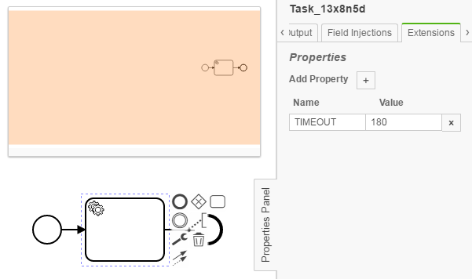
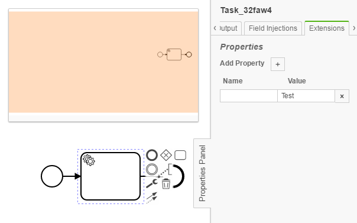
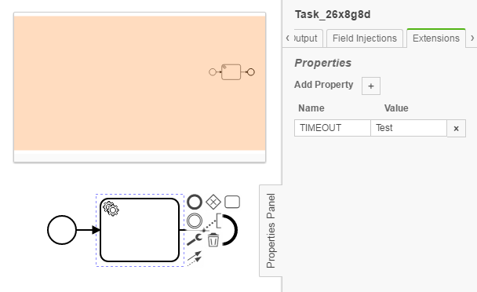

ExtensionChecker
=================================
The ExtensionChecker processes BPMN models and checks whether an element using key-value pairs in the extension panel fit into a desired regex scheme.

## Assumptions
- The **BPMN-models** have to be in the **classpath** at build time

## Configuration
The rule should be configured as follows:
```xml
<rule>
	<name>ExtensionChecker</name>
	<state>true</state>
	<settings>
		<setting name="TIMEOUT" type="ServiceTask" required="false">\d+</setting>
	</settings>
</rule>

```
By setting the name "TIMEOUT" and the value to "\d+", the extension panel of all elements of the specified type will be looked through for this very key-value pair. 
This ensures, that a number with at least one digit is present, otherwise an issue will be created. 
The attribute "required" is used to make sure, that the setting specified in the ruleset will be enforced, meaning it has to find a match, otherwise this will break your build. If "required" is set to false, it will check all elements for a matching key. If it finds a corresponding key, it will be evaluated with the specified regex. Not finding the key will not result in breaking your build.

The settings can consist of more than one setting, allowing the extension panel to have more than one key-value pair. Due to the value being used as regex, it can check for matching strings, chars or numbers.

## Error messages
**Key-Value pair of 'Task_123' could not be resolved due to incorrect or missing key.**

_This message indicates that the key specified in the model does not fit the key specified in the ruleSet.xml._


## Examples

| **Example of correct extension key-value pair**                                                                                    |
|:------------------------------------------------------------------------------------------------------:| 
|         |


| **Example of wrong extension key-value pair with missing key and usage of String instead Integer**                                                                                    |
|:------------------------------------------------------------------------------------------------------:| 
|         |


| **Example of wrong extension key-value pair with usage of String instead Integer**                                                                                    |
|:------------------------------------------------------------------------------------------------------:| 
|         |
