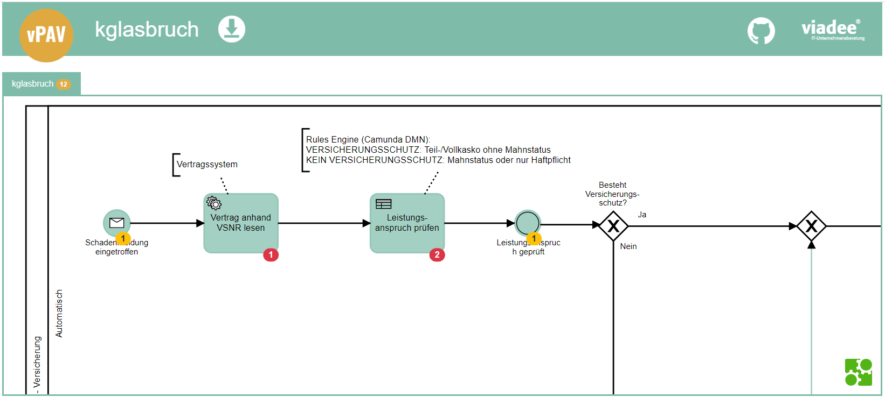
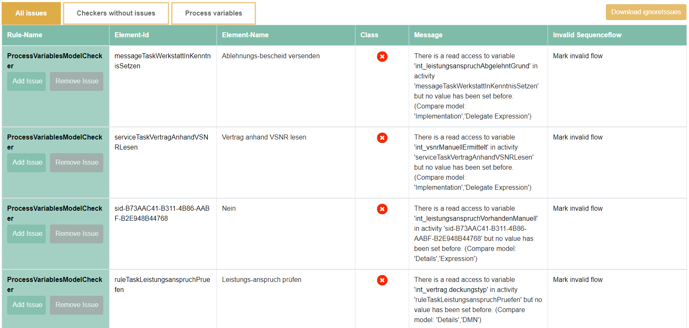
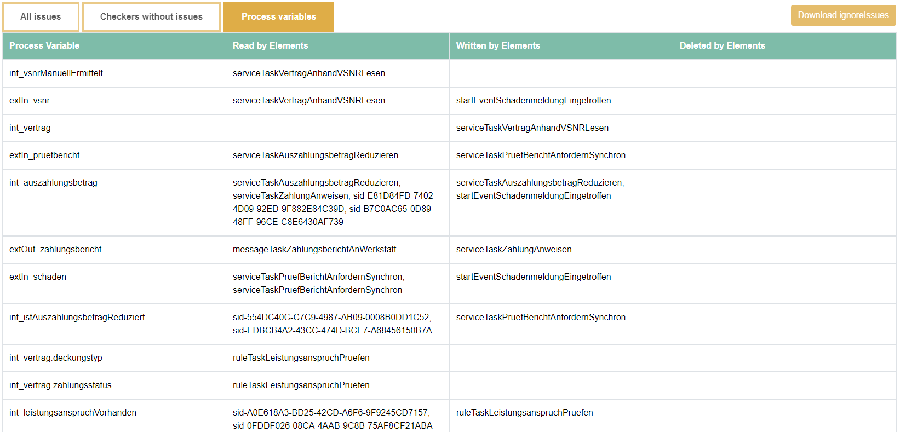

# viadee Process Application Validator (vPAV)
[](https://maven-badges.herokuapp.com/maven-central/de.viadee/viadeeProcessApplicationValidator) [](https://travis-ci.org/viadee/vPAV)

The tool checks Camunda projects for consistency and discovers errors in process-driven applications.
Called as JUnit test, it discovers esp. inconsistencies of a given BPMN model in the classpath and the sourcecode of an underlying java project, such as a delegate reference to a non-existing java class or a non-existing Spring bean.

Find a list of the consistency checks below.

We recommend to integrate the consistency check in your CI builds - you can't find these inconsistencies early enough.

We forked the [Camunda BPM examples](https://github.com/viadee/camunda-bpm-examples/) to demonstrate the easy integration of vPAV.

# Features

## Model-Code Inconsistencies and Checkers
Consistency checks are performed by individual modules called checkers, which search for certain types of inconsistencies. Currently, the following checkers are implemented: 

| Checker                                                                              | Summary                                                                  | Status       |
| ------------------------------------------------------------------------------------ | ----------------------------------------------------------------------   | ------------ |
|[JavaDelegateChecker](JavaDelegateChecker.md)                                         | Is the implementation (or Spring bean reference) available and usable?   | Done         |
|[DmnTaskChecker](DmnTaskChecker.md)                                                   | Is the implementation available?                                         | Done         |
|[EmbeddedGroovyScriptChecker](EmbeddedGroovyScriptChecker.md)                         | Is the implementation available and does it look like a script?          | Done         |
|[ProcessVariablesModelChecker](ProcessVariablesModelChecker.md)                       | Are process variables in the model provided in the code for all paths?   | Done |
|[ProcessVariablesNameConventionChecker](ProcessVariablesNameConventionChecker.md)     | Do process variables in the model fit into a desired regex pattern?      | Done         |
|[TaskNamingConventionChecker](TaskNamingConventionChecker.md)                         | Do task names in the model fit into a desired regex pattern?             | Done         |
|[VersioningChecker](VersioningChecker.md)                                             | Do java classes implementing tasks fit  a version scheme?             | Done         |
|[XorConventionChecker](XorConventionChecker.md)                           		| Are XOR gateways ending with "?" or have default path                                         | Done         |
|[NoScriptChecker](NoScriptChecker.md)                                                 | Is there any script in the model?                                        | Done         |
|[ElementIdConventionChecker](ElementIdConventionChecker.md)                           | Do task ids in the model fit into a desired regex pattern?           | Done         |
|[TimerExpressionChecker](TimerExpressionChecker.md)                                   | Are time events following the ISO 8601 scheme?                                        | Done         |
|[NoExpressionChecker](NoExpressionChecker.md)                                   | Are expressions used against common best-practices?                                        | Done         |
|[MessageEventChecker](MessageEventChecker.md)                                   | Are MessageEvents referencing messages and do they provide message names?                                  | Done         |
|[SignalEventChecker](SignalEventChecker.md)                                   | Are SignalEvents referencing signals and do they provide signal names? Are signal names used more than once in StartEvents?                                  | Done         |
|[DataFlowChecker](DataFlowChecker.md)                                  | Does your model adhere to your configurable rules (read, writes, deletions) ?                                  | Done         |
|[ExtensionChecker](ExtensionChecker.md)                                  | Do tasks using key-value pairs in the extension panel fit into a desired pattern?                                  | Done         |
|[OverlapChecker](OverlapChecker.md)                                   | Are there redundant sequence flows (some may be invisible due to overlap)?              | Done         
|[BoundaryErrorChecker](BoundaryErrorChecker.md)                                   | Do tasks with attached BoundaryErrorEvents use the correct ErrorCode and do the corresponding classes exist?                                  | Experimental         |


All of these can be switched on or off as required. Implementing further checkers is rather simple.

### Configuration
The viadee Process Application Validator uses a rule set to define which checks are executed.
The plugin comes with a default ruleSet.xml which provides some basic rules.
In order to customize the plugin, we recommend creating your own ruleSet.xml and store it in **"src/test/resources"**. 
This allows you to use your own set of rules for naming conventions or to de-/activate certain checkers.
To write your own rule set, you can follow the example of [ruleSetDefault.xml](https://github.com/viadee/vPAV/blob/master/src/main/resources/ruleSetDefault.xml).

### Properties
There are some configurations that have nothing to do with checkers. To define these properties, you have to create a ``vPav.properties`` file and put it in your classpath.
An example of a properties file can be found in the project [Serialized Objects in Embedded Forms](https://github.com/viadee/camunda-bpm-examples/tree/syncfork/usertask/task-form-embedded-serialized-java-object) of our forked camunda-bpm-examples repository.

#### Location of BPMN models
By default, the BPMN models have to be stored in the folder ``src\main\resources`` of your Camunda project. 
You can also load models from other locations of your local filesystem.
In the properties file, use the property ``basepath`` to define the path.
You can use relative paths (e.g. ```basepath=src/main/java```) or absolute paths using the ``file:///`` scheme.

#### Html output
You can disable or enable the HTML output if you want. You can set the property ``outputhtml`` to ``true`` for HTML output or to ``false`` to disable the HTML output.
By default, the HTML output is enabled.

#### Language
As of version 2.5.0, we added localization for english and german users.
By specifying either **en_US** or **de_DE** as ``language`` property, you can choose to use either German or English as language for your visual output report. By leaving it blank, the validator grabs your systems locale and provides either German or English as default. 
Due to some refactoring, more languages can be added in the future by providing language files with the corresponding translations.

### One set of rules to rule them all
Furthermore you can use the plugin to manage multiple projects.
A parent rule set can be shared among them so that you don't have to define the same checkers multiple times.
The parentRuleSet.xml will provide a basic set of rules for all projects that "inherit".
Local sets of rules will override inherited rules in order to allow for customization.

Just create a blank maven project with only the parentRuleSet.xml stored in **"src/main/resources"** and run this project as maven install (make sure to package as jar).

```xml
<dependency>
	<groupId>de.viadee</groupId>
	<artifactId>parent_config</artifactId>
	<version>1.0.0-SNAPSHOT</version>
</dependency>

<dependency>
	<groupId>de.viadee</groupId>
	<artifactId>viadeeProcessApplicationValidator</artifactId>
	<version>...</version>
</dependency>
```

In your child projects you have to add the dependency to the parent project and to vPAV.
The inheritance is only working if you define an own rule set in your child project.
You cannot use the default rule set because it does not include inheritance.

Make sure that inheritance is activated in the ruleSet.xml of your child project.
```xml 
<rule>
	<name>HasParentRuleSet</name>
	<state>true</state>
</rule>
```

### Multiple checker configurations
It might be useful to run a checker two times with different configurations. To prevent a rule from being overridden, you can define an ID.
```xml 
<rule id="xorChecker1">
    <name>XorConventionChecker</name>
	<state>true</state>
	<settings>
	    <setting name="requiredDefault">true</setting>
	</settings>
	<elementConventions>
		<elementConvention>
			<name>convention</name>
			<description>gateway name has to end with an question mark</description>
			<pattern>[A-ZÄÖÜ][a-zäöü]*\\?</pattern>
		</elementConvention>
	</elementConventions>
</rule>
```
If two rule sets are merged (e. g. parent and child rule set), the following inheritance rules apply:
- A parent rule will be overridden if a child rule has the same ID.
- A parent rule will be loaded if no rule with the same ID exists in the child rule set.
- If a rule does not have an ID, the name of the rule will be used and handled as ID.


The following checkers/rules can only be defined once. It it not possible to have different configurations:
- HasParentRuleSet
- CreateOutputHTML
- language
- VersioningChecker
- ProcessVariablesModelChecker
- DataFlowChecker

### Exclusion of false positives
An ignore file can be created to exclude false positives. The file has to be named **"ignoreIssues.txt"** and stored in **"src/test/resources"**. 
Here, you can list IDs of the issues which should be ignored in the next validation run. This must be done line by line. Line comments are initiated with "#".

Unique IDs are generated by a Message Digest. In the files **"bpmn_validation.json"** or **"bpmn_validation.xml"**, you can find each issue attached to its respective ID. Additionally, if you open the modal by clicking an element with issues, the a modal with detailed information will be shown, also including the respective unique ID.  You can also directly whitelist an issue and then download your new ignoreIssues.txt file. This provides a convenient way to avoid copy & pasting your issues into your project.


**Example**
```
# Comment 
8d04f2e77a7d282c521098ab947ac060
```

### Defining your own variables
vPAV is not able to discover all usages of variables yet. Therefore it is annoying if you use a variable and and error is raised altough it is properly defined.
A single variable can cause multiple errors if the definition can't be found. 
Instead of including all errors in the ignore file, vPAV offers a better solution.

You can create a `variables.xml` file in your resource folder. Inside the file variable operations can be defined which should be included in the graph analysis.
You have to provide at least the name of the variable. Moreover, you can define the process id if you're using multiple processes in your bpmn model.
It is also possible to provide the creation point (= when the operation is executed in the process graph) and the scope. Thus it is possible to e.g. limit the availability to a specific element. 
By default, the `write` operation is used. However, by adding the XML element `operation` you can define `read` or `delete` operations.

**Example**
```
<variable>
    <name>numberEntities</name>
    <process>Process_1</process>
    <creationPoint>ServiceTask_108g52x</creationPoint>
    <scope>ServiceTask_108g52x</scope>
    <operation>write</operation>
</variable>
```
In this case the variable definition would be included in the process graph at the beginning of the `ServiceTask_108g52x` and it would be available until the end of the task.

## Output

The result of the check is first of all a direct one: if at least one inconsistency is 
found on the ERROR level, it will break your build or count as a failed unit 
test which will break your build too.

Further, the consistency check will provide an XML version, a JSON version and
an visual version based on  [BPMN.io](https://bpmn.io/) of all errors and warnings found.

### Visual output
The header contains the name of the current model. Below the heading, you can select a different model of the project to be displayed.
You can zoom in and out with the mouse wheel and move the model by click and hold.

There are two different view modes with each providing a different overlay for the model and tables with additional information.

To find the visual output, check the created vPAV folder inside your project's target folder. Open the **validationResult.html** with any browser to explore your process model and the found issues.

#### Issue Overlay
In the BPMN model, the elements with errors are highlighted. Error categories are indicated by color. 
An overlay specifies the number of errors found on an element. Details can be seen by clicking on the overlay.
All errors are laid out in a table below the model. Clicking on the _rulename_ opens the corresponding documentation.
Clicking on the _Element-Id_ or _invalid sequenceflow_ marks the corresponding element(s) in the model.

##### Model


##### Issue Table


#### Variable Overlay

In the BPMN model, all detected operations to process variables are highlighted. 
An overlay specifies the number of reads, writes and deletes.
By clicking on the overlay further information can be obtained including the names of process variables and exact location of operation.
A table below the model lists all process variable and their operations.
Clicking on the process variable name highlights all model elements with operations to this variables.
Clicking on element IDs marks the corresponding element in the model.


##### Model


##### Issue Table


## Requirements
- JDK 8
- Camunda BPM Engine 7.4.0 and above

## Installation/Usage

### Maven
Add the dependency to your POM:

```xml
<dependency>
  <groupId>de.viadee</groupId>
  <artifactId>viadeeProcessApplicationValidator</artifactId>
  <version>...</version>
  <scope>test</scope>
</dependency>
```

### JUnit
Configure a JUnit-4 Test to fire up your usual Spring context - esp. delegates referenced in the process, 
if you use Spring in your application or a simple test case otherwise to call the consistency check.

The recommended name for this class is ModelConsistencyTest, where you 
call the ProcessApplicationValidator by simply using code like the following:

```java
import de.viadee.bpm.vPAV.ProcessApplicationValidator;
...
@RunWith(SpringJUnit4ClassRunner.class)
@ContextConfiguration(classes = { SpringTestConfig.class })
public class ModelConsistencyTest{
        
    @Autowired
    private ApplicationContext ctx;   
    
    @Test
    public void validateModel() {
        assertTrue("Model inconsistency found. Please check target folder for validation output",
                ProcessApplicationValidator.findModelErrors(ctx).isEmpty());
    }
}

```
Note, that the Validator receives the Spring context. Thereby, the validation can
check delegate Beans and their names.


#### Methods
The `ctx` parameter is optional. If **no** Spring context is used, JUnit can also be started without the context parameter.

- `findModelErrors(ctx)` finds all model inconsistencies with **ERROR** status.

- `findModelInconsistencies(ctx)` finds **all** model inconsistencies (Error, Warning, Info).


#### SpringTestConfig

In order to evaluate beans in a Spring environment, you should specify a config class for your JUnit test

```java

import ServiceTaskOneDelegate;
import ServiceTaskTwoDelegate;
import org.mockito.InjectMocks;
import org.mockito.MockitoAnnotations;
import org.springframework.context.annotation.Bean;
import org.springframework.context.annotation.Configuration;

@Configuration
public class SpringTestConfig {

    public SpringTestConfig() {
        MockitoAnnotations.initMocks(this);
    }

    @InjectMocks
    private ServiceTaskOneDelegate serviceTaskOneDelegate;

    @InjectMocks
    private ServiceTaskTwoDelegate serviceTaskTwoDelegate;

    @Bean
    public ServiceTaskOneDelegate serviceTaskOneDelegate() {
        return serviceTaskOneDelegate;
    }

    @Bean
    public ServiceTaskTwoDelegate serviceTaskTwoDelegate() {
        return serviceTaskTwoDelegate;
    }

}
```
#### Add external checker 
You can also simply add your own checker. 
You can find an example project [here](https://github.com/viadee/vPAV_checker_plugin_example).
In your projects you have to add the dependency to the project with the checker-class(es) (see example below) and to vPAV ([see above](#maven)):

```xml
<dependency>
	<groupId>de.viadee</groupId>
	<artifactId>vPAV_checker_plugin_example</artifactId>
	<version>1.0.0-SNAPSHOT</version>
</dependency>
```
Run this project (e.g. vPAV_checker_plugin_example) as maven install (make sure to package as jar). 

The `setting name="external_Location"` defines the checker as an external checker.
The value specifies the location of the checkerclass.

```xml
<rule>
	<name>TaskNamingConventionCheckerExtern</name>
	<state>true</state>
	<settings>
		<setting name="external_Location">de.viadee.vPAV_checker_plugin_example</setting>
	</settings>
	<elementConventions>
		<elementConvention>
			<name>convention</name>
			<pattern>[A-ZÄÖÜ][a-zäöü\\\-\\\s]+</pattern>
		</elementConvention>
	</elementConventions>
</rule>
```
##### Requirements
- Your checker-class have to extends the *AbstractElementChecker*. 
- Only the parameters from the abstract class (`de.viadee.bpm.vPAV.config.model.Rule` and `de.viadee.bpm.vPAV.BPMNScanner`) are allowed in the constructor.

#### Checker instructions
You have to return a collection of `de.viadee.bpm.vPAV.processing.model.data.CheckerIssue`.

``` java
/**
* CheckerIssue
* 
* @param ruleName
*            Name of the Rule
* @param classification
*            Classification (Info, Warning or Error) of the rule
* @param bpmnFile
*            Path to the BPMNFile
* @param resourceFile
*            Path to resource file (e.g. dmn oder java)
* @param elementId
*            Id of the Element with issue
* @param elementName
*            Name of the Element with issue
* @param variable
*            Name of variable
* @param anomaly
*            Type of anomaly (DD, DU, UR)
* @param invalidPaths
*            Invalid path
* @param message
*            Issue message
*/
 ```

#### Additionally required dependencies 

```xml
<dependency>
	<groupId>org.mockito</groupId>
	<artifactId>mockito-all</artifactId>
	<version>1.10.19</version>
	<scope>test</scope>
</dependency>

<dependency>	
	<groupId>org.springframework</groupId>
	<artifactId>spring-test</artifactId>
	<version>4.3.11.RELEASE</version>
</dependency>
		
<dependency>
	<groupId>org.springframework</groupId>
	<artifactId>spring-beans</artifactId>
	<version>4.3.11.RELEASE</version>
</dependency>

<dependency>
	<groupId>junit</groupId>
	<artifactId>junit</artifactId>
	<version>4.12</version>
</dependency>
```

## Release Notes
You can find our release notes over [here](https://github.com/viadee/vPAV/blob/development/docs/ReleaseNotes.md).

## Commitments
This library will remain under an open source licence indefinately.

We follow the [semantic versioning](http://semver.org) scheme (2.0.0).

In the sense of semantic versioning, the resulting XML and JSON outputs are the _only public API_ provided here. 
We will keep these as stable as possible, in order to enable users to analyse and integrate results into the toolsets of their choice.

## Cooperation
Feel free to report issues, questions, ideas or patches. We are looking forward to it.

## Resources
Status of the development branch: [](https://travis-ci.org/viadee/vPAV)

## Licenses
All licenses of reused components can be found on the [maven site](http://rawgit.com/viadee/vPAV/master/docs/MavenSite/project-info.html)

</br> Additionally we use the following third-party dependencies, that are not covered via maven-found licences:
- [BPMN.io](https://bpmn.io/license/) tool under the bpmn.io license. 
- [Bootstrap](https://github.com/twbs/bootstrap/blob/v4-dev/LICENSE) licensed under MIT
- [jQuery](https://jquery.org/license/) licensed under MIT
- [PopperJS](https://github.com/FezVrasta/popper.js/blob/master/LICENSE.md) licensed under MIT
- [Soot](https://github.com/Sable/soot) licensed under a LGPL 2.1  license

Soot and bpmn.io provide the basis for the two most exciting features of the validator, i.e. finding inconsistencies in the data and control flow across model and code an the visualization thereof. We would like to explicitly thank these two communities for their continued effort.

**BSD 3-Clause License** <br/>

Copyright (c) 2019, viadee IT-Unternehmensberatung AG
All rights reserved.

Redistribution and use in source and binary forms, with or without
modification, are permitted provided that the following conditions are met:

* Redistributions of source code must retain the above copyright notice, this
  list of conditions and the following disclaimer.

* Redistributions in binary form must reproduce the above copyright notice,
  this list of conditions and the following disclaimer in the documentation
  and/or other materials provided with the distribution.

* Neither the name of the copyright holder nor the names of its
  contributors may be used to endorse or promote products derived from
  this software without specific prior written permission.

THIS SOFTWARE IS PROVIDED BY THE COPYRIGHT HOLDERS AND CONTRIBUTORS "AS IS"
AND ANY EXPRESS OR IMPLIED WARRANTIES, INCLUDING, BUT NOT LIMITED TO, THE
IMPLIED WARRANTIES OF MERCHANTABILITY AND FITNESS FOR A PARTICULAR PURPOSE ARE
DISCLAIMED. IN NO EVENT SHALL THE COPYRIGHT HOLDER OR CONTRIBUTORS BE LIABLE
FOR ANY DIRECT, INDIRECT, INCIDENTAL, SPECIAL, EXEMPLARY, OR CONSEQUENTIAL
DAMAGES (INCLUDING, BUT NOT LIMITED TO, PROCUREMENT OF SUBSTITUTE GOODS OR
SERVICES; LOSS OF USE, DATA, OR PROFITS; OR BUSINESS INTERRUPTION) HOWEVER
CAUSED AND ON ANY THEORY OF LIABILITY, WHETHER IN CONTRACT, STRICT LIABILITY,
OR TORT (INCLUDING NEGLIGENCE OR OTHERWISE) ARISING IN ANY WAY OUT OF THE USE
OF THIS SOFTWARE, EVEN IF ADVISED OF THE POSSIBILITY OF SUCH DAMAGE.
